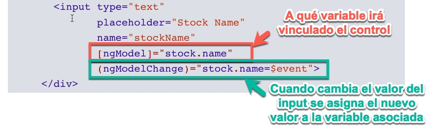

# a) ¿Cuáles son las principales diferencias entre formularios dirigidos por template y formularios reactivos?

* Los formularios por template son más limitados para las validaciones, ya que casi toda la lógica va implementada desde la plantilla html.
* Los formularios reactivos toda la lógica se programa desde el componente TypeScript, da mucha más libertad para programar y validar los datos.

# b) ¿Qué son, para qué sirven y cómo se utilizan las directivas ngModel y ngModelChange?

* La directiva **ngModel** asignamos el control a una variable del componente.
* La directiva **ngModelChange** Cuando se produce un cambio asignamos el nuevo valor a la variable asociada.

# c) ¿Qué son, cuáles son y para qué sirven los estados en los formularios dirigidos por templates?

* required: Se le proporciona a un campo para que sea obligatorio su completado
* minlength: Obliga a que el campo tenga un mínimo de caracteres.
* maxlength: Obliga a que el campo tenga un máximo de caracteres.
* '
': si name contiene errores, en este caso, si hay error porque es requerido y está vacío. Cuando no hay errores, errors es null, de ahí el ?.
* pattern="[a-z0-9._%+-]+@[a-z0-9.-]+\.[a-z]{2,3}$": patrón que debe serguir un input para que no de error en cada pulsación. En este caso se trata de un patrón para emails.

# d) ¿Qué ventajas aportan los FormGroup en la composición de formularios?

* El formGroup nos permite agrupar los controles y de esta manera podemos pasar la información resultante como un objeto con todos los valores.
* También nos permite validar el formulario entero, si uno de los controles no es válido el formGroup no será válido.